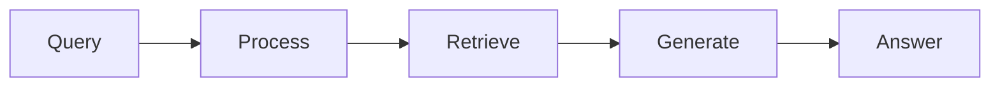

# CLAUDE.md

This file provides guidance to Claude Code (claude.ai/code) when working with code in this repository.

## Project Overview

This is an educational tutorial repository that teaches RAG (Retrieval-Augmented Generation) patterns through conceptual explanations, simple code examples, and visual diagrams. The goal is to create a high-quality reference resource that developers can learn from and adapt for their own projects.

**Current State:** Repository has been restructured from automation system to static tutorial. README.md is updated. Need to build out pattern examples following the new structure.

## Repository Purpose

This is a **static educational resource**, NOT an automation system. The focus is:

- Clear conceptual explanations of RAG patterns
- Simple, runnable code examples to illustrate concepts
- Visual diagrams (ASCII art + mermaid) to aid understanding
- Beginner-to-advanced learning path
- Production-quality patterns that developers can reference

## Directory Structure

```
rag-patterns-guide/
├── patterns/
│   ├── 01-semantic-chunking/
│   │   ├── README.md              # Concept explanation + architecture diagram
│   │   ├── example.py             # Simple working implementation
│   │   └── test_example.py        # Test cases demonstrating behavior
│   ├── 02-hyde/
│   ├── 03-parent-child-retrieval/
│   ├── 04-query-decomposition/
│   ├── 05-reranking/
│   ├── 06-metadata-filtering/
│   ├── 07-ensemble-retrieval/
│   └── 08-recursive-retrieval/
├── demos/
│   └── semantic-chunking/         # Existing fuller demo (can be kept as reference)
├── requirements.txt               # Shared dependencies
├── README.md                      # Tutorial landing page
└── CLAUDE.md                      # This file
```

## Pattern Structure

Each pattern directory (`patterns/XX-pattern-name/`) should contain:

### 1. README.md
The conceptual guide with:
- **Problem Statement** (2-3 sentences) - What challenge does this solve?
- **How It Works** (1-2 paragraphs) - Core concept explanation
- **Architecture Diagram** (mermaid) - Visual representation of data flow
- **When to Use** (bullet points) - Real-world scenarios
- **Trade-offs** (bullet points) - Performance, complexity, cost considerations
- **Code Example** (snippet) - Key parts of implementation with explanation
- **Running the Example** (commands) - How to test it locally
- **Further Reading** (links) - Papers, blog posts, related resources

### 2. example.py
Simple, focused implementation:
- Minimal dependencies (prefer standard RAG libraries)
- Well-commented explaining engineering decisions
- Uses `rich` library for colored terminal output (cyan/green/yellow/red)
- Demonstrates ONE concept clearly
- Runnable with simple command: `python example.py`
- ~100-200 lines max (keep it focused)

### 3. test_example.py
Test cases showing:
- Expected behavior with sample queries
- Edge cases
- ASCII output validation (if relevant)
- Can be run with: `pytest test_example.py -v`

## Visual Standards

### ASCII Art Output (using Rich library)

All code examples should use colored terminal output:

```python
from rich.console import Console
from rich.panel import Panel

console = Console()

# Query input - CYAN
console.print(Panel("User query here", title="📥 Input", border_style="cyan"))

# Retrieval results - GREEN
console.print(Panel("Retrieved docs", title="🔎 Results", border_style="green"))

# LLM generation - YELLOW
console.print(Panel("Generated answer", title="🧠 Output", border_style="yellow"))

# Errors - RED
console.print(Panel("Error details", title="❌ Error", border_style="red"))
```

### Mermaid Diagrams

Each pattern README should include a mermaid architecture diagram showing:
- Input (query)
- Processing steps
- Data flow
- Output (answer)

Example:


## RAG Patterns to Implement

Priority order (8-10 patterns total):

1. **Semantic Chunking** (beginner) - Foundation of RAG systems
2. **Metadata Filtering** (beginner) - Structured search basics
3. **Re-ranking** (beginner) - Improving retrieval quality
4. **HyDE** (intermediate) - Query expansion techniques
5. **Parent-Child Retrieval** (intermediate) - Context optimization
6. **Query Decomposition** (intermediate) - Handling complex queries
7. **Ensemble Retrieval** (intermediate) - Hybrid search methods
8. **Recursive Retrieval** (advanced) - Multi-hop reasoning
9. **Agentic RAG** (advanced) - LLM-driven retrieval decisions
10. **Self-Query** (intermediate) - Natural language to structured filters

## Implementation Guidelines

### Code Quality
- Keep examples simple and focused (concept over complexity)
- Use production RAG frameworks (LangChain, LlamaIndex)
- Include inline comments explaining "why" not just "what"
- Make examples self-contained and runnable
- Use type hints for clarity

### Writing Style
- Explain concepts before showing code
- Use clear, accessible language (avoid unnecessary jargon)
- Include concrete examples and use cases
- Highlight trade-offs and practical considerations
- Link to further reading (papers, docs, tutorials)

### Testing
- Include realistic test queries
- Show expected behavior
- Test edge cases
- Validate ASCII output formatting (if applicable)

## Development Commands

```bash
# Run a specific pattern example
cd patterns/01-semantic-chunking
python example.py

# Run tests for a pattern
cd patterns/01-semantic-chunking
pytest test_example.py -v

# Install all dependencies
pip install -r requirements.txt
```

## Tech Stack

- **Python 3.10+**
- **RAG Frameworks:** LangChain, LlamaIndex
- **Vector DBs:** ChromaDB (local), Pinecone, Weaviate
- **LLMs:** OpenAI, Anthropic Claude
- **Embeddings:** OpenAI, Sentence Transformers
- **Visualization:** Rich (terminal), Mermaid (diagrams)
- **Testing:** pytest

## What NOT to Do

- ❌ Don't build automation or CI/CD pipelines
- ❌ Don't create LinkedIn posting functionality
- ❌ Don't use GitHub Actions for automation
- ❌ Don't make patterns overly complex
- ❌ Don't skip conceptual explanations
- ❌ Don't forget visual diagrams

## What TO Do

- ✅ Focus on clear concept explanations
- ✅ Keep code examples simple and focused
- ✅ Include visual diagrams (ASCII + mermaid)
- ✅ Make everything runnable locally
- ✅ Structure content for progressive learning
- ✅ Highlight practical trade-offs
- ✅ Link to further resources

## Contributing Template

When adding a new pattern:

1. Create directory: `patterns/XX-pattern-name/`
2. Write README.md with concept explanation + diagram
3. Implement example.py with clear comments
4. Add test_example.py with sample queries
5. Update main README.md to link to new pattern
6. Ensure all code is tested and runnable

## Notes

- This is a learning resource, not a production codebase
- Prioritize clarity over completeness
- Each pattern should teach ONE thing well
- Visual aids are crucial for understanding
- Examples should be minimal but working (no stubs)
