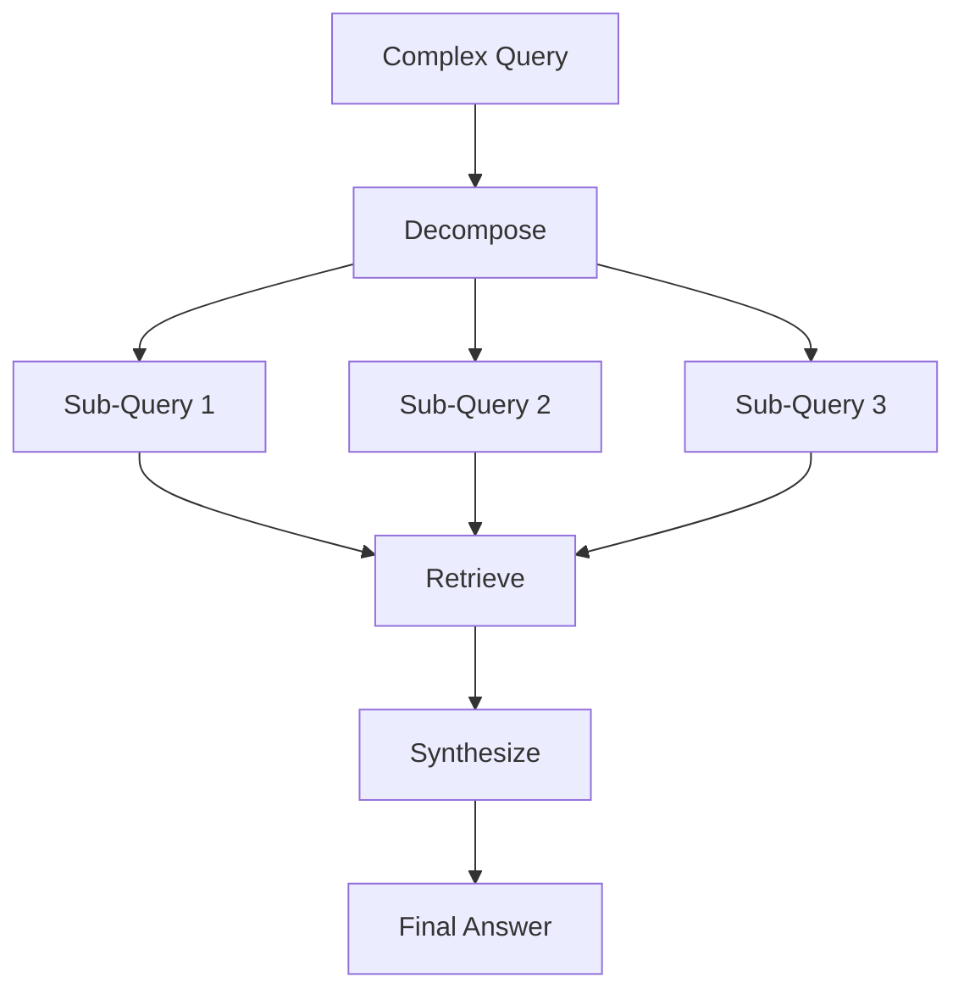

# 🎓 RAG Patterns Guide

> **A comprehensive visual guide to production RAG patterns**

Learn Retrieval-Augmented Generation (RAG) patterns through clear conceptual explanations, working code examples, and visual diagrams. Each pattern demonstrates a real-world technique used in production AI systems.

## 🎯 What You'll Learn

This guide covers essential RAG patterns, from foundational concepts to advanced techniques:

### Currently Available Patterns

1. **[Semantic Chunking](patterns/01-semantic-chunking/)** (Beginner) - Smart document splitting at semantic boundaries
2. **[HyDE](patterns/02-hyde/)** (Intermediate) - Hypothetical Document Embeddings for query expansion
3. **[Re-ranking](patterns/03-reranking/)** (Beginner) - Two-stage retrieval for better relevance
4. **[Metadata Filtering](patterns/04-metadata-filtering/)** (Beginner) - Pre-filter with structured data

### Coming Soon

- **Parent-Child Retrieval** - Context optimization with hierarchical chunks
- **Query Decomposition** - Breaking complex queries into focused sub-questions
- **Ensemble Retrieval** - Combining BM25 + vector search
- **Recursive Retrieval** - Multi-hop reasoning for complex questions
- **Agentic RAG** - LLM-driven retrieval decisions
- **Self-Query** - Natural language to structured filters

Each pattern includes:
- 📝 **Conceptual explanation** - Why and when to use it
- 💡 **Working code examples** - Simple, runnable implementations
- 🎨 **Visual diagrams** - Architecture and data flow
- 🧪 **Test cases** - Real queries and expected behavior

## 🎨 Visual Learning Approach

All examples use colored ASCII output to visualize the RAG workflow:

```
╔═══════════════════════════════════════════════════════════════╗
║  🔍 QUERY DECOMPOSITION RAG                                   ║
╚═══════════════════════════════════════════════════════════════╝

📥 User Query:
   "What are the performance implications of using asyncio vs threading?"

🧩 Decomposed into:
   ├─ Q1: "asyncio performance characteristics"
   ├─ Q2: "threading performance characteristics"
   └─ Q3: "asyncio vs threading benchmarks"

🔎 Vector Search Results:
   Q1 ─→ 📄 Doc_032 (score: 0.94) ─→ ✓ Retrieved
   Q2 ─→ 📄 Doc_117 (score: 0.91) ─→ ✓ Retrieved
   Q3 ─→ 📄 Doc_089 (score: 0.89) ─→ ✓ Retrieved

🧠 LLM Synthesis:
   ├─ Tokens in:  2,847
   ├─ Tokens out: 412
   └─ Latency:    1.3s

✅ Response Generated
```

Plus mermaid diagrams showing architecture:



## 📁 Repository Structure

```
rag-patterns-guide/
├── patterns/
│   ├── 01-semantic-chunking/
│   │   ├── README.md              # Concept explanation + diagram
│   │   ├── example.py             # Working implementation
│   │   └── test_example.py        # Test cases
│   ├── 02-hyde/
│   ├── 03-parent-child-retrieval/
│   └── ...
├── demos/
│   └── semantic-chunking/         # Full runnable demo (existing)
└── README.md                      # This file
```

## 🚀 Getting Started

### Prerequisites

```bash
python 3.10+
pip install -r requirements.txt
```

### Running Examples

Each pattern is self-contained:

```bash
cd patterns/01-semantic-chunking
python example.py
```

### Running Tests

```bash
cd patterns/01-semantic-chunking
pytest test_example.py -v
```

## 🎓 Learning Path

**Beginners** - Start here:
1. Semantic Chunking - Foundation of RAG systems
2. Metadata Filtering - Structured search basics
3. Re-ranking - Improving retrieval quality

**Intermediate** - Build on fundamentals:
4. HyDE - Query expansion techniques
5. Parent-Child Retrieval - Context optimization
6. Query Decomposition - Handling complex queries
7. Ensemble Retrieval - Hybrid search methods

**Advanced** - Production patterns:
8. Recursive Retrieval - Multi-hop reasoning
9. Agentic RAG - LLM-driven retrieval decisions
10. Self-Query - Natural language to structured filters

## 🛠️ Tech Stack

- **RAG Frameworks:** LangChain, LlamaIndex
- **Vector DBs:** ChromaDB, Pinecone, Weaviate
- **LLMs:** OpenAI, Anthropic Claude
- **Embeddings:** OpenAI, Sentence Transformers
- **Visualization:** Rich (terminal), Mermaid (diagrams)

## 🎨 Pattern Format

Each pattern follows this structure:

1. **Problem Statement** - What challenge does this solve?
2. **Concept Explanation** - How does it work?
3. **Architecture Diagram** - Visual representation
4. **Code Example** - Simple, working implementation
5. **When to Use** - Real-world scenarios
6. **Trade-offs** - Performance, complexity, cost considerations
7. **Further Reading** - Papers, blog posts, resources

## 🤝 Contributing

Want to add a pattern or improve an explanation? PRs welcome! Please:

1. Follow the existing pattern structure
2. Include working code examples
3. Add visual diagrams (mermaid)
4. Write clear conceptual explanations
5. Include test cases

## 📚 Resources

- [LangChain RAG Documentation](https://python.langchain.com/docs/use_cases/question_answering/)
- [LlamaIndex Retrieval Guide](https://docs.llamaindex.ai/en/stable/understanding/retrieval/)
- [RAG Papers & Research](https://github.com/your-link-here)

## 📝 License

MIT - Learn, build, share knowledge

---

**Focus on concepts, not complexity. Production patterns made understandable.**
