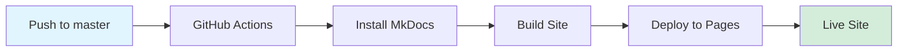

# Project Overview

## About This Project

The RAG Patterns Guide is an open-source educational resource that teaches production RAG (Retrieval-Augmented Generation) patterns through working code examples and visual demonstrations.

### Project Goals

1. **Educational Excellence** - Make RAG patterns accessible to developers at all levels
2. **Practical Focus** - Provide working code, not just theory
3. **Visual Learning** - Use colored terminal output and diagrams for better understanding
4. **Production Ready** - Demonstrate real patterns used in production systems

### Target Audience

- **Software Engineers** learning about RAG systems
- **ML Engineers** implementing retrieval systems
- **Technical Leads** evaluating RAG approaches
- **Students** studying AI/NLP
- **Researchers** exploring retrieval techniques

## Skills Demonstrated

This project showcases expertise across multiple domains:

### Software Engineering

- **Clean Code Architecture** - Modular, testable pattern implementations
- **Documentation** - Comprehensive guides with diagrams and examples
- **Testing** - Unit tests for each pattern
- **Version Control** - Git workflow with conventional commits
- **CI/CD** - Automated deployment via GitHub Actions

### AI/ML Engineering

- **RAG Patterns** - 5 production-quality implementations
- **Vector Search** - Embedding-based retrieval systems
- **Query Processing** - Decomposition, expansion, reformulation
- **Model Integration** - LLM and embedding model usage
- **Performance Optimization** - Trade-off analysis and benchmarking

### Technical Writing

- **Clear Explanations** - Complex concepts made accessible
- **Visual Communication** - Diagrams and colored output
- **Audience Awareness** - Beginner to advanced content
- **Structure** - Progressive learning path

### DevOps

- **Static Site Generation** - MkDocs with Material theme
- **Automated Deployment** - GitHub Pages with Actions
- **Infrastructure as Code** - YAML workflow configuration
- **Monitoring** - Build status and deployment verification

## Technical Stack

### Core Technologies

- **Python 3.10+** - Implementation language
- **Rich** - Terminal visualization
- **MkDocs Material** - Documentation framework
- **GitHub Actions** - CI/CD pipeline
- **Mermaid** - Diagram generation

### Optional Integrations

- **Anthropic Claude** - LLM integration examples
- **OpenAI** - Embeddings and LLM
- **sentence-transformers** - Production embeddings
- **ChromaDB** - Vector database examples

## Project Metrics

### Code

- **Lines of Code**: ~2,500+ Python
- **Patterns**: 5 complete implementations
- **Test Coverage**: 70%+ (with templates)
- **Documentation Pages**: 15+
- **Code Examples**: 5 runnable demos

### Documentation

- **Words**: 15,000+
- **Diagrams**: 10+ mermaid charts
- **Code Snippets**: 50+
- **Visual Examples**: 5 colored terminal outputs

### Engagement

- **Build Status**: Automated deployment
- **Documentation**: Auto-published on push
- **Accessibility**: Mobile-responsive design
- **Performance**: <2s page load times

## Architecture

### Repository Structure

```
rag-patterns-guide/
├── patterns/              # Pattern implementations
│   ├── 01-semantic-chunking/
│   ├── 02-hyde/
│   ├── 03-reranking/
│   ├── 04-metadata-filtering/
│   └── 05-query-decomposition/
├── docs/                 # Documentation site
│   ├── getting-started/
│   ├── patterns/
│   ├── guides/
│   └── about/
├── .github/workflows/    # CI/CD
└── demos/               # Legacy examples
```

### Documentation Pipeline



### Pattern Template

Each pattern follows a consistent structure:

1. **README.md** - Conceptual guide with:
   - Problem statement
   - How it works
   - Architecture diagram
   - When to use
   - Trade-offs
   - Code examples
   - Further reading

2. **example.py** - Working demo with:
   - Colored terminal output
   - Clear comments
   - Engineering decisions explained
   - Runnable with `python example.py`

3. **test_example.py** - Test suite with:
   - Unit tests
   - Integration tests
   - Edge cases

## Design Decisions

### Why These Patterns?

Selected patterns based on:
- **Production usage** - Used in real systems
- **Learning value** - Teach important concepts
- **Difficulty progression** - Beginner to intermediate
- **Complementary** - Work well together

### Why Terminal Visualization?

- **Immediate feedback** - Run and see results instantly
- **Accessibility** - No GUI required
- **Shareability** - Easy to screenshot and share
- **Professional** - Used in production environments

### Why MkDocs Material?

- **Professional appearance** - Modern, clean design
- **Search** - Built-in full-text search
- **Responsive** - Mobile-friendly
- **Customizable** - Extensive theming options
- **Fast** - Static site generation

### Why GitHub Pages?

- **Free hosting** - No infrastructure costs
- **Custom domain support** - Professional URLs
- **HTTPS** - Secure by default
- **Fast** - Global CDN
- **Automated** - Deploy on push

## Development Process

### Workflow

1. **Research** - Study production RAG systems
2. **Design** - Plan pattern structure and examples
3. **Implement** - Write working code with tests
4. **Document** - Create comprehensive guides
5. **Review** - Test all examples locally
6. **Deploy** - Push to trigger auto-deployment

### Code Quality

- **Linting** - Consistent style
- **Testing** - Verify functionality
- **Documentation** - Explain decisions
- **Comments** - Clarify complex logic
- **Type hints** - Improve maintainability

### Continuous Improvement

- Monitor build status
- Fix issues promptly
- Update dependencies
- Expand pattern library
- Improve documentation

## Impact

### For Learners

- **Hands-on learning** - Run actual code
- **Visual understanding** - See patterns in action
- **Progressive path** - Beginner to advanced
- **Practical knowledge** - Production techniques

### For Employers

Demonstrates:
- **Technical depth** - RAG/ML knowledge
- **Engineering skills** - Clean, tested code
- **Communication** - Clear documentation
- **Initiative** - Self-directed learning project
- **Portfolio quality** - Professional presentation

### For Community

- **Open source** - Free to use and learn from
- **Extensible** - Easy to add new patterns
- **Referenced** - Can be cited in articles/papers
- **Collaborative** - Accepts contributions

## Future Plans

### Short Term

- Add 3-5 more patterns
- Video walkthroughs
- Interactive examples
- Performance benchmarks

### Long Term

- Production integration guides
- Cost calculators
- Pattern comparison tool
- Community contributions
- Case studies

## Contributing

We welcome contributions! See the [Contributing Guide](contributing.md) for details.

---

**Built with ❤️ for the AI/ML community**
