# Pattern Selector

Not sure which RAG pattern to use? Answer a few questions to get a personalized recommendation.

## Interactive Decision Tree

```mermaid
graph TD
    Start[What's your main challenge?] --> A{Choose one}

    A -->|Documents too long| B[How are they split now?]
    A -->|Poor retrieval quality| C[What's the issue?]
    A -->|Users ask complex questions| D[Question type?]
    A -->|Need to filter results| E[What criteria?]

    B -->|Fixed character count| S1[✅ Semantic Chunking]
    B -->|Already split well| C

    C -->|Questions don't match docs| H1[✅ HyDE]
    C -->|Good matches ranked low| R1[✅ Re-ranking]
    C -->|Getting wrong versions/languages| M1[✅ Metadata Filtering]

    D -->|Comparisons or multi-part| Q1[✅ Query Decomposition]
    D -->|Simple factual| C

    E -->|Version, date, language| M1
    E -->|Access control| M1
    E -->|Document type| M1

    S1 --> Details1[View Pattern →]
    H1 --> Details2[View Pattern →]
    R1 --> Details3[View Pattern →]
    M1 --> Details4[View Pattern →]
    Q1 --> Details5[View Pattern →]

    click Details1 "../patterns/01-semantic-chunking"
    click Details2 "../patterns/02-hyde"
    click Details3 "../patterns/03-reranking"
    click Details4 "../patterns/04-metadata-filtering"
    click Details5 "../patterns/05-query-decomposition"
```



## Quick Selector

### By Symptom

!!! question "My documents are getting cut off mid-sentence"
    **→ [Semantic Chunking](../patterns/01-semantic-chunking.md)**

    Splits at natural boundaries instead of character limits.

!!! question "Users ask questions but docs are statements"
    **→ [HyDE](../patterns/02-hyde.md)**

    Generates hypothetical answers to bridge vocabulary gap.

!!! question "Relevant docs appear in positions 5-10, not 1-3"
    **→ [Re-ranking](../patterns/03-reranking.md)**

    Two-stage retrieval finds best matches.

!!! question "Getting outdated documentation or wrong language"
    **→ [Metadata Filtering](../patterns/04-metadata-filtering.md)**

    Pre-filter by version, date, language, etc.

!!! question "Users ask 'Compare X vs Y' and get incomplete answers"
    **→ [Query Decomposition](../patterns/05-query-decomposition.md)**

    Breaks complex queries into focused sub-questions.

### By Use Case

| Use Case | Recommended Pattern | Why |
|----------|-------------------|-----|
| Technical documentation | Semantic Chunking + Metadata Filtering | Preserve context, filter by version |
| Customer support FAQ | HyDE + Re-ranking | Match questions to answers accurately |
| Research/analysis | Query Decomposition + Re-ranking | Handle complex queries comprehensively |
| Multi-language content | Metadata Filtering | Enforce language constraints |
| Legal/medical documents | Re-ranking + Metadata Filtering | High precision requirements |

### By Constraints

**Latency Budget:**
- < 100ms: Basic patterns only (Semantic Chunking, Metadata Filtering)
- 100-300ms: Add Re-ranking
- 300ms+: All patterns available

**Precision Requirements:**
- High (medical, legal): Re-ranking + Metadata Filtering
- Medium (general): Semantic Chunking + Basic filtering
- Exploration: Query Decomposition

**Development Time:**
- Quick (1 day): Semantic Chunking, Metadata Filtering
- Medium (2-3 days): Re-ranking, HyDE
- Longer (1 week): Query Decomposition, combinations

## Pattern Combinations

Many patterns work better together:

### Recommended Stacks

**📚 Documentation Search**
```
Semantic Chunking (preprocessing)
→ Metadata Filtering (version/language)
→ Vector Search
→ Re-ranking
```

**❓ Question Answering**
```
HyDE (query expansion)
→ Vector Search
→ Re-ranking
→ LLM Generation
```

**🔬 Research/Analysis**
```
Query Decomposition
→ Parallel Retrieval
→ Combine & Dedupe
→ Re-ranking
```

**🏢 Enterprise Multi-tenant**
```
Metadata Filtering (access control)
→ Semantic Chunking
→ Vector Search
```

## Decision Matrix

Use this table to compare patterns across key dimensions:

| Pattern | Complexity | Latency | Precision Gain | Best For |
|---------|-----------|---------|---------------|----------|
| Semantic Chunking | ⭐⭐ | Pre-compute | ⭐⭐⭐⭐ | Long documents |
| HyDE | ⭐⭐⭐ | +300-500ms | ⭐⭐⭐⭐ | Q&A systems |
| Re-ranking | ⭐⭐ | +150-250ms | ⭐⭐⭐⭐⭐ | High precision |
| Metadata Filtering | ⭐ | <10ms | ⭐⭐⭐⭐⭐ | Constrained search |
| Query Decomposition | ⭐⭐⭐⭐ | +500-800ms | ⭐⭐⭐⭐ | Complex queries |

## Still Not Sure?

Answer these questions:

1. **What's your latency budget?**
   - If < 100ms, stick to basic patterns
   - If flexible, explore advanced patterns

2. **What type of content?**
   - Structured (API docs): Metadata Filtering
   - Unstructured (articles): Semantic Chunking
   - Mixed: Both

3. **What are users asking?**
   - Simple facts: Basic search
   - Questions: HyDE
   - Comparisons: Query Decomposition

4. **How critical is precision?**
   - Life/death (medical): Re-ranking + Filtering
   - Important (business): Re-ranking
   - Exploration: Basic patterns

5. **Do you have metadata?**
   - Yes: Always use Metadata Filtering
   - No: Focus on semantic patterns

## Next Steps

1. **Pick a pattern** from the recommendations above
2. **[Install the guide](../getting-started/installation.md)** and try the example
3. **Read the pattern docs** to understand trade-offs
4. **Combine patterns** for production use

---

**Still have questions?** Check the [Pattern Overview](../patterns/overview.md) or [open an issue](https://github.com/PeteSumners/rag-showroom/issues)!
