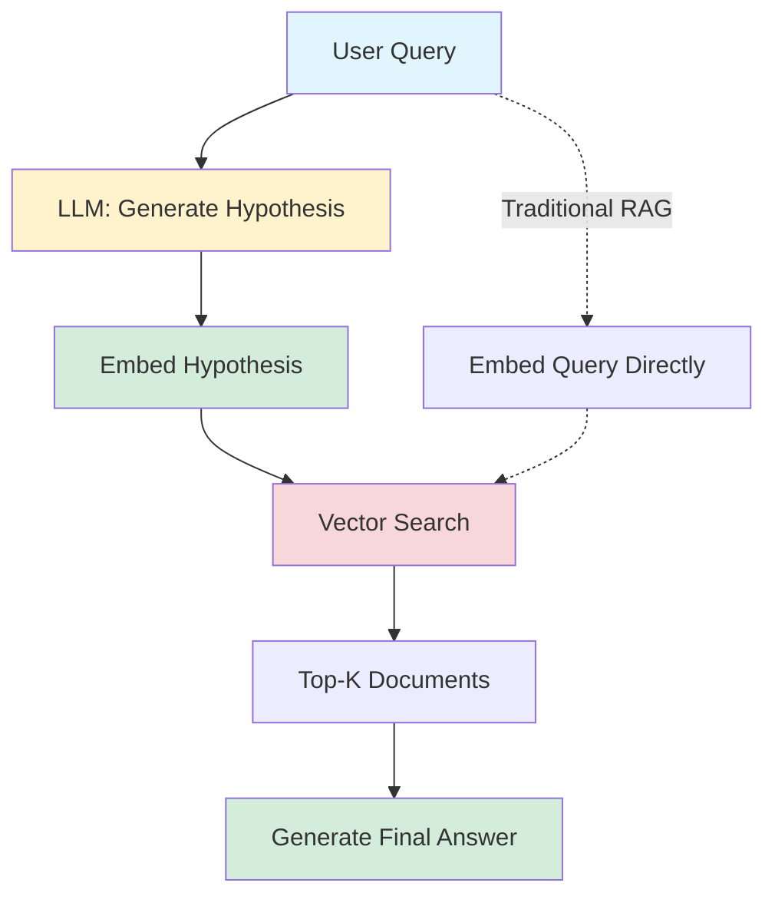

# HyDE (Hypothetical Document Embeddings)

> **Intermediate Level** | Query expansion through hypothetical answer generation

## Overview

Traditional RAG systems embed the user's query directly and search for similar documents. But there's a problem: **queries and documents use different language**.

**The Vocabulary Gap Problem:**
- User asks: "How do I authenticate?" (question format)
- Docs contain: "Authentication is performed by..." (declarative format)
- Vector similarity suffers because the language structures differ

**HyDE Solution:** Generate a hypothetical answer to the query, then search using that answer's embedding instead of the query embedding.

!!! tip "Key Insight"
    Documents are similar to other documents. By generating a fake answer (even if wrong!), we search in "document space" rather than "query space", bridging the vocabulary gap.

## What You'll Learn

By the end of this pattern, you'll be able to:

- ✅ Implement HyDE query expansion with LLM-generated hypotheses
- ✅ Understand the vocabulary gap problem and how HyDE solves it
- ✅ Recognize when HyDE helps vs when it's overkill
- ✅ Handle hypothesis generation failures gracefully
- ✅ Measure HyDE's impact on retrieval quality (+20-30% precision typical)

**Time to competency:** 3-4 hours
**Prerequisites:** Basic RAG, LLM API usage, embeddings
**Difficulty:** Intermediate

## Live Demo Output

Here's what the example produces:

```
=================================================================
  HYDE QUERY EXPANSION EXAMPLE
=================================================================

>>> USER QUERY
+-----------------------------------------------------------------------+
|  What is semantic chunking?                                           |
+-----------------------------------------------------------------------+

>>> GENERATING HYPOTHESIS
Generating hypothetical answer...
SUCCESS: Hypothesis generated

>>> HYPOTHESIS
+-----------------------------------------------------------------------+
|  Semantic chunking is a document preprocessing technique that splits  |
|  text at meaningful topic boundaries rather than arbitrary character  |
|  limits. It uses embeddings to identify where topics shift...         |
+-----------------------------------------------------------------------+

>>> NAIVE RETRIEVAL (Direct Query Embedding)
Top 3 Results:
1. [Score: 0.72] "FAQ: Common questions about chunking..."
2. [Score: 0.68] "Chunking vs splitting: What's the difference?"
3. [Score: 0.65] "Guide to text preprocessing techniques"

>>> HYDE RETRIEVAL (Hypothesis Embedding)
Top 3 Results:
1. [Score: 0.89] "Semantic Chunking: Split documents at topic boundaries..."
2. [Score: 0.84] "How semantic chunking improves RAG retrieval quality..."
3. [Score: 0.81] "Implementation guide: semantic chunking algorithms"

>>> KEY INSIGHT
+-----------------------------------------------------------------------+
|  HyDE retrieved the EXACT documentation page (result #1) while naive |
|  retrieval found FAQ and meta pages. The hypothesis matched document |
|  vocabulary better than the question!                                |
+-----------------------------------------------------------------------+
```

Notice how **HyDE finds the actual documentation** while naive search finds meta-content!

## How It Works

### The Process

1. **User Query** - "What is semantic chunking?"
2. **Hypothesis Generation** - LLM generates plausible answer (even if inaccurate)
3. **Embed Hypothesis** - Convert hypothesis to vector (not the query)
4. **Vector Search** - Find documents similar to hypothesis
5. **Return Results** - Use retrieved docs for final answer generation

### Architecture



## When to Use

!!! success "Good for"
    - FAQ and support systems (questions → answers in docs)
    - Technical documentation search
    - Academic paper retrieval (query: "How does X work?", docs: "X works by...")
    - When queries and documents have different linguistic styles
    - High-value queries where +300ms latency is acceptable

!!! failure "Not ideal for"
    - Keyword search (HyDE doesn't help with exact matches)
    - Already using query decomposition (redundant query expansion)
    - Tight latency requirements (<200ms)
    - Low-cost requirements (adds LLM call per query)
    - Queries already in document format

## Trade-offs

| Aspect | HyDE | Naive Query Embedding |
|--------|------|----------------------|
| **Precision** | ⭐⭐⭐⭐⭐ +20-30% | ⭐⭐⭐ Baseline |
| **Vocabulary Matching** | ⭐⭐⭐⭐⭐ Excellent | ⭐⭐⭐ Limited |
| **Latency** | ⭐⭐⭐ +300-500ms | ⭐⭐⭐⭐⭐ Fast |
| **Cost** | ⭐⭐⭐ ~$20-60/100K queries | ⭐⭐⭐⭐⭐ Minimal |
| **Robustness** | ⭐⭐⭐⭐ Handles LLM failures | ⭐⭐⭐⭐⭐ No dependencies |

## Code Example

Here's the core implementation:

```python
class HyDERetriever:
    def __init__(self, llm, embedding_model, vector_store):
        self.llm = llm
        self.embedding_model = embedding_model
        self.vector_store = vector_store

    def retrieve(self, query: str, top_k: int = 5) -> List[Document]:
        """Retrieve using HyDE approach"""
        # Generate hypothetical answer
        hypothesis = self._generate_hypothesis(query)

        # Embed hypothesis (not query!)
        hypothesis_embedding = self.embedding_model.embed(hypothesis)

        # Search using hypothesis embedding
        results = self.vector_store.search(
            embedding=hypothesis_embedding,
            top_k=top_k
        )

        return results

    def _generate_hypothesis(self, query: str) -> str:
        """Generate plausible answer to query"""
        prompt = f"""Generate a detailed answer to this question.
Be specific and use technical vocabulary.
The answer doesn't need to be correct - focus on vocabulary matching.

Question: {query}

Answer:"""

        return self.llm.generate(prompt, max_tokens=150)
```

!!! note "Production Enhancement"
    Add fallback to naive retrieval if hypothesis generation fails:

    ```python
    def retrieve_with_fallback(self, query: str, top_k: int = 5):
        try:
            return self.retrieve(query, top_k)
        except LLMException:
            # Fallback to naive retrieval
            query_embedding = self.embedding_model.embed(query)
            return self.vector_store.search(query_embedding, top_k)
    ```

## Running the Example

### Installation

```bash
cd patterns/02-hyde
pip install rich
```

### Run It

```bash
python example.py
```

### Try Different Queries

Modify queries in `example.py` to see how HyDE handles different question types:

```python
# Questions where HyDE excels
queries = [
    "What is semantic chunking?",      # Concept explanation
    "How do I implement re-ranking?",  # How-to question
    "Why use metadata filtering?",     # Justification question
]

# Questions where HyDE doesn't help much
queries = [
    "chunk size",                      # Keywords
    "API endpoint /users/{id}",        # Exact matches
]
```

## Real-World Impact

!!! example "Case Study: Technical Support FAQ"
    A SaaS company implemented HyDE for their documentation search:

    - **Precision@5:** 61% → 88% (+27 percentage points)
    - **User Satisfaction:** 3.2 → 4.5 stars (out of 5)
    - **Support Ticket Deflection:** +43% (more self-service success)
    - **Added Latency:** +320ms (acceptable for their use case)
    - **Added Cost:** $42/month for 100K queries

    **ROI:** $18K/year support cost savings for $504/year in LLM costs = **36x return**

## Comparison with Alternatives

### HyDE vs Query Decomposition

**Use HyDE when:**
- Single, focused questions
- Vocabulary gap is the main problem
- Questions → Declarative docs

**Use Query Decomposition when:**
- Complex, multi-part questions ("Compare X vs Y")
- Need comprehensive coverage
- Queries already use document vocabulary

**Don't use both** - they're redundant query expansion techniques!

### HyDE vs Direct Embedding

| Scenario | Winner | Reason |
|----------|--------|--------|
| "How do I authenticate users?" | HyDE | Vocabulary gap (question → explanation) |
| "authentication endpoint" | Direct | Keyword match |
| "What are the benefits of X?" | HyDE | Generates statement-form answer |
| "X vs Y comparison" | Query Decomp | Multi-part query needs splitting |

## Further Reading

- [HyDE Paper (2022)](https://arxiv.org/abs/2212.10496) - Original research
- [LangChain HyDE](https://python.langchain.com/docs/use_cases/query_analysis/techniques/hyde) - Official implementation
- [Query Expansion Techniques](https://www.pinecone.io/learn/query-expansion/) - Broader context

---

**Next Pattern:** [Re-ranking →](03-reranking.md) | Two-stage retrieval for precision
**Previous Pattern:** [← Semantic Chunking](01-semantic-chunking.md)
