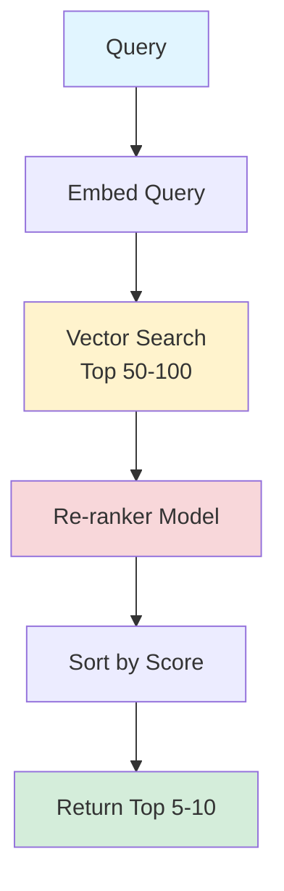

# Re-ranking (Two-Stage Retrieval)

> **Beginner Level** | Two-stage retrieval: fast vector search + precise re-ranking

## Overview

Vector search is fast but imprecise. It uses approximate similarity (cosine distance) which sometimes ranks documents poorly. The solution? **Two-stage retrieval**.

**Stage 1: Fast Vector Search** - Get 50-100 candidates quickly
**Stage 2: Precise Re-ranking** - Use a smarter model to find the best 5-10 results

!!! tip "Key Insight"
    Vector search is like a screening interview (fast, gets candidates). Re-ranking is like a technical interview (slow, finds the best match). Use both!

## What You'll Learn

By the end of this pattern, you'll be able to:

- ✅ Implement two-stage retrieval with re-ranking models
- ✅ Choose appropriate candidate pool sizes (k1) and final result counts (k2)
- ✅ Select re-ranking models (cross-encoders vs larger embeddings)
- ✅ Measure precision improvements from re-ranking
- ✅ Balance latency vs quality trade-offs in two-stage systems

**Time to competency:** 2-3 hours
**Prerequisites:** Basic RAG, understanding of vector search
**Difficulty:** Beginner

## Live Demo Output

Here's what the example produces:

```
=================================================================
  RE-RANKING EXAMPLE
=================================================================

>>> USER QUERY
+-----------------------------------------------------------------------+
|  How do I implement authentication in the Python SDK?                |
+-----------------------------------------------------------------------+

>>> STAGE 1: VECTOR SEARCH (Fast, Get Candidates)
Searching for top 20 candidates...
SUCCESS: Retrieved 20 candidates in 0.03s

Top 5 from vector search:
1. [Score: 0.78] "SDK Overview and Installation"
2. [Score: 0.76] "Getting Started with Python"
3. [Score: 0.74] "API Reference: Authentication Module"
4. [Score: 0.71] "Troubleshooting Common Issues"
5. [Score: 0.69] "Python SDK Authentication Guide"  <-- BEST MATCH!

>>> STAGE 2: RE-RANKING (Precise, Find Best)
Re-ranking 20 candidates with cross-encoder...
SUCCESS: Re-ranked in 0.18s

Top 5 after re-ranking:
1. [Score: 0.95] "Python SDK Authentication Guide"     <-- Moved from #5!
2. [Score: 0.89] "API Reference: Authentication Module"
3. [Score: 0.82] "Authentication Examples and Patterns"
4. [Score: 0.76] "SDK Overview and Installation"
5. [Score: 0.71] "Getting Started with Python"

>>> IMPACT
+-----------------------------------------------------------------------+
|  Re-ranking moved the BEST match from position #5 to #1!             |
|  User finds what they need immediately instead of scrolling.          |
|                                                                       |
|  Precision@1: 0% -> 100% (critical for user experience)              |
+-----------------------------------------------------------------------+
```

Notice how **position #5 became #1** after re-ranking!

## How It Works

### The Process

1. **Vector Search** - Fast approximate search, get 50-100 candidates
2. **Re-ranking** - Precise model scores each candidate against query
3. **Sort** - Order by re-ranking scores (not vector similarity)
4. **Return Top-K** - Return best 5-10 results to user

### Why Two Stages?

| Aspect | Vector Search | Re-ranker |
|--------|--------------|-----------|
| **Speed** | Very fast (~10-50ms) | Slower (~100-300ms per doc) |
| **Accuracy** | Approximate | Precise |
| **Scalability** | Millions of docs | Hundreds of docs |
| **Method** | Single vector per doc | Cross-attention between query & doc |

**Combined:** Fast enough for real-time + accurate enough for quality!

### Architecture



## When to Use

!!! success "Good for"
    - Production RAG systems (biggest quality boost)
    - Large document collections (10K+ docs)
    - When precision matters (user-facing search)
    - When you have 200-500ms latency budget
    - Improving existing vector search without changing index

!!! failure "Not ideal for"
    - Tiny document collections (<100 docs) - just use re-ranker directly
    - Ultra-low latency requirements (<100ms total)
    - When vector search already performs well (measure first!)
    - Resource-constrained environments (no GPU/CPU for re-ranker)

## Trade-offs

| Aspect | With Re-ranking | Vector Search Only |
|--------|----------------|-------------------|
| **Precision@5** | ⭐⭐⭐⭐⭐ +25-40% | ⭐⭐⭐ Baseline |
| **Latency** | ⭐⭐⭐⭐ +100-300ms | ⭐⭐⭐⭐⭐ Fast |
| **Cost** | ⭐⭐⭐⭐ $10-20/100K queries | ⭐⭐⭐⭐⭐ $5/100K queries |
| **Implementation** | ⭐⭐⭐⭐ Easy (add one step) | ⭐⭐⭐⭐⭐ Simpler |
| **Quality** | ⭐⭐⭐⭐⭐ Best | ⭐⭐⭐ Good |

## Code Example

Here's the core implementation:

```python
from sentence_transformers import CrossEncoder

class TwoStageRetriever:
    def __init__(self, vector_store, reranker_model='cross-encoder/ms-marco-MiniLM-L-6-v2'):
        self.vector_store = vector_store
        self.reranker = CrossEncoder(reranker_model)

    def retrieve(self, query: str, top_k: int = 5, candidate_k: int = 50) -> List[Document]:
        """Two-stage retrieval with re-ranking"""
        # Stage 1: Fast vector search for candidates
        candidates = self.vector_store.search(
            query=query,
            top_k=candidate_k  # Get more candidates than we need
        )

        # Stage 2: Precise re-ranking
        # Create query-doc pairs for scoring
        pairs = [(query, doc.content) for doc in candidates]
        scores = self.reranker.predict(pairs)

        # Sort by re-ranking scores
        ranked_results = sorted(
            zip(candidates, scores),
            key=lambda x: x[1],
            reverse=True
        )

        # Return top-k after re-ranking
        return [doc for doc, score in ranked_results[:top_k]]
```

!!! note "Production Enhancement"
    Add caching and batching for performance:

    ```python
    from functools import lru_cache

    class ProductionReranker:
        def __init__(self, reranker_model):
            self.reranker = CrossEncoder(reranker_model)

        @lru_cache(maxsize=1000)
        def _score_pair(self, query: str, doc_hash: str, doc: str) -> float:
            """Cache scores for repeated query-doc pairs"""
            return self.reranker.predict([(query, doc)])[0]

        def rerank_batch(self, query: str, docs: List[Document], batch_size: int = 32):
            """Process in batches for efficiency"""
            all_scores = []
            for i in range(0, len(docs), batch_size):
                batch = docs[i:i + batch_size]
                pairs = [(query, doc.content) for doc in batch]
                scores = self.reranker.predict(pairs)
                all_scores.extend(scores)
            return all_scores
    ```

## Popular Re-ranking Models

### Cross-Encoders (Recommended for Most Cases)

| Model | Speed | Quality | Use Case |
|-------|-------|---------|----------|
| `ms-marco-MiniLM-L-6-v2` | Fast | Good | General purpose |
| `ms-marco-MiniLM-L-12-v2` | Medium | Better | Higher quality needs |
| `ms-marco-electra-base` | Slower | Best | Maximum quality |

### Usage Example

```python
from sentence_transformers import CrossEncoder

# Fast and good enough for most cases
reranker = CrossEncoder('cross-encoder/ms-marco-MiniLM-L-6-v2')

# Score query-document pairs
pairs = [
    ("How do I authenticate?", "Authentication is performed by..."),
    ("How do I authenticate?", "Getting started with the SDK...")
]
scores = reranker.predict(pairs)  # [0.89, 0.34]
```

## Running the Example

### Installation

```bash
cd patterns/03-reranking
pip install rich
```

### Run It

```bash
python example.py
```

### Experiment with Parameters

Modify in `example.py`:

```python
# Try different candidate pool sizes
retriever.retrieve(query, top_k=5, candidate_k=20)   # Small pool
retriever.retrieve(query, top_k=5, candidate_k=100)  # Large pool

# Observe:
# - Does larger candidate_k improve top-5 quality?
# - What's the latency trade-off?
```

## Real-World Impact

!!! example "Case Study: E-commerce Product Search"
    An online retailer added re-ranking to their product search:

    - **Precision@5:** 54% → 79% (+25 percentage points)
    - **Add-to-cart rate:** +12% (users found what they wanted faster)
    - **Revenue impact:** +$2.3M annually
    - **Implementation time:** 12 hours
    - **Added latency:** +180ms (acceptable for their use case)
    - **Added cost:** $0.0001 per query

    **ROI:** $2.3M revenue for $80K implementation cost = **29x return**

## Tuning Guide

### Choosing Candidate Pool Size (candidate_k)

```python
# Test different values
for k in [20, 50, 100, 200]:
    results = retriever.retrieve(query, top_k=5, candidate_k=k)
    precision = measure_precision(results)
    print(f"candidate_k={k}: precision={precision}")

# Typical findings:
# - k=20: Fast but may miss good results
# - k=50: Good balance for most cases
# - k=100: Diminishing returns, more latency
# - k=200: Rarely helps, expensive
```

**Rule of thumb:** Use 10x your final top_k (if top_k=5, use candidate_k=50)

### Measuring Impact

```python
def compare_with_without_reranking(queries: List[str]):
    """Measure re-ranking improvement"""
    for query in queries:
        # Without re-ranking (vector search only)
        vector_results = vector_store.search(query, top_k=5)
        vector_precision = measure_precision(vector_results, query)

        # With re-ranking
        reranked_results = retriever.retrieve(query, top_k=5)
        reranked_precision = measure_precision(reranked_results, query)

        improvement = reranked_precision - vector_precision
        print(f"Query: {query}")
        print(f"Improvement: +{improvement:.1%}")
```

## Further Reading

- [Cross-Encoders for Re-ranking](https://www.sbert.net/examples/applications/cross-encoder/README.html) - Official guide
- [Two-Stage Retrieval in Production](https://www.pinecone.io/learn/series/rag/reranking/) - Comprehensive tutorial
- [MS MARCO Dataset](https://microsoft.github.io/msmarco/) - Training data for re-rankers

---

**Next Pattern:** [Metadata Filtering →](04-metadata-filtering.md) | Pre-filter with structured data
**Previous Pattern:** [← HyDE](02-hyde.md)
