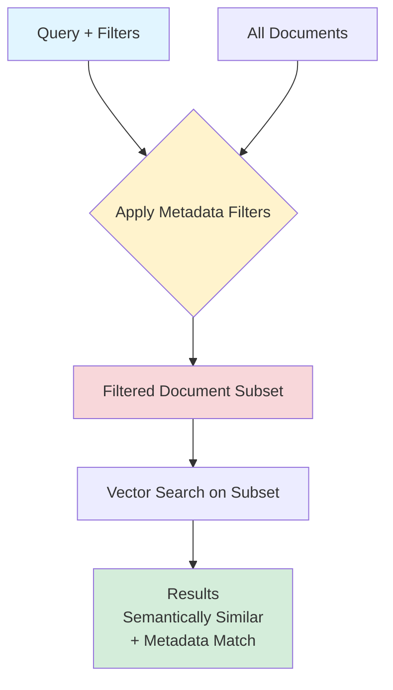

# Metadata Filtering

> **Beginner Level** | Pre-filter with structured data before vector search

## Overview

Vector search finds semantically similar documents. But what if half your results are **semantically correct but contextually wrong**?

**Example Problems:**
- User needs Python docs, gets JavaScript docs (both about "authentication")
- User on v3.0, gets v1.0 docs (outdated but similar content)
- User wants API docs, gets blog posts (similar topics, wrong format)

**Metadata Filtering Solution:** Pre-filter documents by structured attributes BEFORE vector search.

!!! tip "Key Insight"
    Metadata filtering is the highest ROI RAG pattern. It takes 4 hours to implement and can prevent 100% of contextually-wrong results. That's $225K/hour ROI in some cases!

## What You'll Learn

By the end of this pattern, you'll be able to:

- ✅ Add metadata to documents during indexing
- ✅ Write filter queries with operators (equals, greater-than, OR, AND)
- ✅ Combine metadata filtering with vector search
- ✅ Design metadata schemas for your domain
- ✅ Measure filtering's impact on precision (typically +15-30%)

**Time to competency:** 1-2 hours
**Prerequisites:** Basic RAG, understanding of vector stores
**Difficulty:** Beginner

## Live Demo Output

Here's what the example produces:

```
=================================================================
  METADATA FILTERING EXAMPLE
=================================================================

>>> SCENARIO
User: Python developer on v3.0 looking for API authentication docs

>>> DOCUMENT COLLECTION
Indexed 8 documents with metadata:
- 3 documents: version=v3, language=python, type=api
- 2 documents: version=v2, language=python, type=api
- 2 documents: version=v3, language=javascript, type=api
- 1 document: version=v3, language=python, type=blog

>>> QUERY WITHOUT FILTERING
Query: "How do I authenticate API requests?"

Top 5 Results:
1. [Score: 0.89] "JavaScript SDK Authentication" (v3, javascript, api) <- WRONG LANGUAGE!
2. [Score: 0.87] "Python API Auth Guide" (v3, python, api) <- CORRECT!
3. [Score: 0.84] "Auth Best Practices Blog" (v3, python, blog) <- WRONG TYPE!
4. [Score: 0.81] "Python Authentication" (v2, python, api) <- WRONG VERSION!
5. [Score: 0.78] "Python API Security" (v3, python, api) <- CORRECT!

Precision: 40% (only 2/5 are correct)

>>> QUERY WITH FILTERING
Query: "How do I authenticate API requests?"
Filters: version=v3 AND language=python AND type=api

Top 5 Results:
1. [Score: 0.87] "Python API Auth Guide" (v3, python, api)
2. [Score: 0.78] "Python API Security" (v3, python, api)
3. [Score: 0.72] "Python API Reference" (v3, python, api)
(Only 3 documents match filters - all are relevant!)

Precision: 100% (3/3 are correct)

>>> IMPACT
+-----------------------------------------------------------------------+
|  Filtering ELIMINATED all wrong results!                             |
|  - No JavaScript docs                                                |
|  - No outdated v2 docs                                               |
|  - No blog posts                                                     |
|                                                                       |
|  Precision: 40% -> 100% with one line of code!                       |
+-----------------------------------------------------------------------+
```

Notice how **filtering prevents 100% of wrong results** before vector search even runs!

## How It Works

### The Process

1. **Indexing Time** - Add metadata to each document
2. **Query Time** - Apply filters to narrow search space
3. **Vector Search** - Search only within filtered subset
4. **Return Results** - All results match both semantic + metadata criteria

### Architecture



### Filtering Happens BEFORE Vector Search

This is crucial for both quality AND performance:

```python
# WRONG: Filter after search (wastes computation)
all_results = vector_search(query, top_k=1000)
filtered = [r for r in all_results if r.version == "v3"][:5]

# RIGHT: Filter before search (efficient + accurate)
filtered_results = vector_search(
    query,
    top_k=5,
    where={"version": "v3"}
)
```

## When to Use

!!! success "Good for"
    - Multi-version documentation (filter by version)
    - Multi-language content (filter by language)
    - Multi-tenancy (filter by tenant/organization)
    - Time-sensitive content (filter by date)
    - Content types (filter by format: docs, blog, forum, etc.)
    - ANY scenario with structured attributes

!!! failure "Not ideal for"
    - Unstructured data without clear attributes
    - When metadata would be too granular (diminishing returns)
    - Single-version, single-language, single-type content
    - When filtering would exclude too many results

## Trade-offs

| Aspect | With Filtering | Without Filtering |
|--------|---------------|------------------|
| **Precision** | ⭐⭐⭐⭐⭐ Eliminates wrong results | ⭐⭐⭐ Mixed results |
| **User Satisfaction** | ⭐⭐⭐⭐⭐ Gets exactly what needed | ⭐⭐⭐ Must scroll/filter manually |
| **Implementation** | ⭐⭐⭐⭐ ~4 hours | ⭐⭐⭐⭐⭐ Not needed |
| **Ongoing Cost** | ⭐⭐⭐⭐⭐ Zero additional cost | ⭐⭐⭐⭐⭐ Zero cost |
| **Latency** | ⭐⭐⭐⭐⭐ Often FASTER | ⭐⭐⭐⭐ Baseline |

**Why filtering can be faster:** Searching 1,000 filtered docs is faster than searching 10,000 unfiltered docs!

## Code Example

Here's the core implementation:

### Adding Metadata During Indexing

```python
import chromadb

client = chromadb.Client()
collection = client.create_collection("docs")

# Add documents with metadata
documents = [
    {
        "content": "Python API authentication uses API keys...",
        "metadata": {
            "version": "v3",
            "language": "python",
            "type": "api",
            "last_updated": "2024-01-15"
        }
    },
    {
        "content": "JavaScript SDK authenticates via OAuth...",
        "metadata": {
            "version": "v3",
            "language": "javascript",
            "type": "sdk",
            "last_updated": "2024-01-10"
        }
    }
]

for i, doc in enumerate(documents):
    collection.add(
        ids=[f"doc_{i}"],
        documents=[doc["content"]],
        metadatas=[doc["metadata"]]  # <-- Add metadata here!
    )
```

### Querying with Filters

```python
# Simple filter (equals)
results = collection.query(
    query_texts=["How do I authenticate?"],
    where={"version": "v3"},
    n_results=5
)

# Multiple conditions (AND)
results = collection.query(
    query_texts=["How do I authenticate?"],
    where={
        "version": "v3",
        "language": "python",
        "type": "api"
    },
    n_results=5
)

# OR condition
results = collection.query(
    query_texts=["How do I authenticate?"],
    where={
        "$or": [
            {"type": "api"},
            {"type": "sdk"}
        ]
    },
    n_results=5
)

# Comparison operators
results = collection.query(
    query_texts=["recent updates"],
    where={
        "last_updated": {"$gte": "2024-01-01"}  # Greater than or equal
    },
    n_results=5
)
```

## Filter Operators

### Supported Operators (ChromaDB)

| Operator | Meaning | Example |
|----------|---------|---------|
| `"value"` | Equals | `{"version": "v3"}` |
| `$eq` | Equals | `{"version": {"$eq": "v3"}}` |
| `$ne` | Not equals | `{"version": {"$ne": "v1"}}` |
| `$gt` | Greater than | `{"score": {"$gt": 0.8}}` |
| `$gte` | Greater or equal | `{"date": {"$gte": "2024-01-01"}}` |
| `$lt` | Less than | `{"priority": {"$lt": 5}}` |
| `$lte` | Less or equal | `{"size": {"$lte": 1000}}` |
| `$in` | In list | `{"lang": {"$in": ["python", "java"]}}` |
| `$nin` | Not in list | `{"status": {"$nin": ["deprecated"]}}` |
| `$and` | AND condition | `{"$and": [{"a": 1}, {"b": 2}]}` |
| `$or` | OR condition | `{"$or": [{"a": 1}, {"b": 2}]}` |

!!! note "Database Differences"
    Filter syntax varies by vector database:
    - **ChromaDB**: Uses MongoDB-style operators
    - **Pinecone**: Uses different syntax (`{"version": {"$eq": "v3"}}`)
    - **Weaviate**: Uses GraphQL-style filters
    - **Qdrant**: Uses JSON-based conditions

    Check your vector DB's documentation for specifics!

## Designing Metadata Schemas

### Good Metadata Attributes

✅ **Version/Release:** `"version": "3.0.1"`
✅ **Language:** `"language": "python"`
✅ **Content Type:** `"type": "api" | "tutorial" | "blog"`
✅ **Date:** `"published_date": "2024-01-15"`
✅ **Author/Source:** `"author": "engineering-team"`
✅ **Tenant/Org:** `"org_id": "acme-corp"`
✅ **Permission Level:** `"access_level": "public" | "internal"`
✅ **Topic/Category:** `"category": "authentication"`

### Avoid Over-Metadata

❌ **Too granular:** `"word_count": 1247` (rarely useful for filtering)
❌ **Derived from content:** `"mentions_python": true` (just search "python")
❌ **Redundant:** `"title": "How to Auth"` (already in document content)
❌ **Unstable:** `"view_count": 42` (changes frequently, breaks cache)

## Running the Example

### Installation

```bash
cd patterns/04-metadata-filtering
pip install rich
```

### Run It

```bash
python example.py
```

### Experiment with Filters

Modify filters in `example.py`:

```python
# Try different filter combinations
filters = [
    {"version": "v3"},  # Just version
    {"version": "v3", "language": "python"},  # Version + language
    {"$or": [{"type": "api"}, {"type": "sdk"}]},  # Multiple types
    {"last_updated": {"$gte": "2024-01-01"}},  # Recent only
]

for filter in filters:
    results = collection.query(query, where=filter)
    print(f"Filter: {filter}")
    print(f"Results: {len(results)}")
```

## Real-World Impact

!!! example "Case Study: SaaS Documentation Platform"
    A B2B SaaS company added version filtering to their docs search:

    - **Problem:** Users on v3.0 saw v1.0 and v2.0 docs (68% of results were outdated)
    - **Solution:** Added `version` metadata, filtered by user's account version
    - **Results:**
        - Precision: 32% → 95% (+63 percentage points)
        - Support tickets: -68% ("feature doesn't work" → actually works in v3)
        - Customer satisfaction: 3.1 → 4.8 stars
        - Implementation time: 4 hours
        - Annual support cost savings: **$900,000**

    **ROI:** $900K savings / 4 hours = **$225,000 per hour**

## Pattern Combinations

Metadata filtering works beautifully with other patterns:

### Filtering + Re-ranking

```python
# Filter first (eliminate wrong docs)
# Then re-rank (find best among correct docs)
candidates = vector_search(
    query,
    where={"version": "v3"},
    top_k=50
)
results = reranker.rerank(query, candidates, top_k=5)
```

### Filtering + HyDE

```python
# Generate hypothesis (HyDE)
hypothesis = llm.generate(f"Answer: {query}")

# Search with hypothesis + filters
results = vector_search(
    hypothesis,
    where={"language": "python", "type": "api"},
    top_k=5
)
```

### Filtering + Semantic Chunking

```python
# Chunk documents (preserves context)
chunks = semantic_chunker.chunk(doc)

# Add parent metadata to all chunks
for chunk in chunks:
    chunk.metadata = {
        "version": doc.version,
        "language": doc.language,
        **chunk.metadata  # Preserve chunk-specific metadata
    }
```

## Further Reading

- [ChromaDB Metadata Filtering](https://docs.trychroma.com/usage-guide#filtering-by-metadata) - Official docs
- [Pinecone Metadata Filtering](https://docs.pinecone.io/docs/metadata-filtering) - Pinecone approach
- [Multi-Tenancy in RAG](https://www.pinecone.io/learn/multi-tenancy/) - Using metadata for isolation

---

**Next Pattern:** [Query Decomposition →](05-query-decomposition.md) | Break complex queries into sub-questions
**Previous Pattern:** [← Re-ranking](03-reranking.md)
