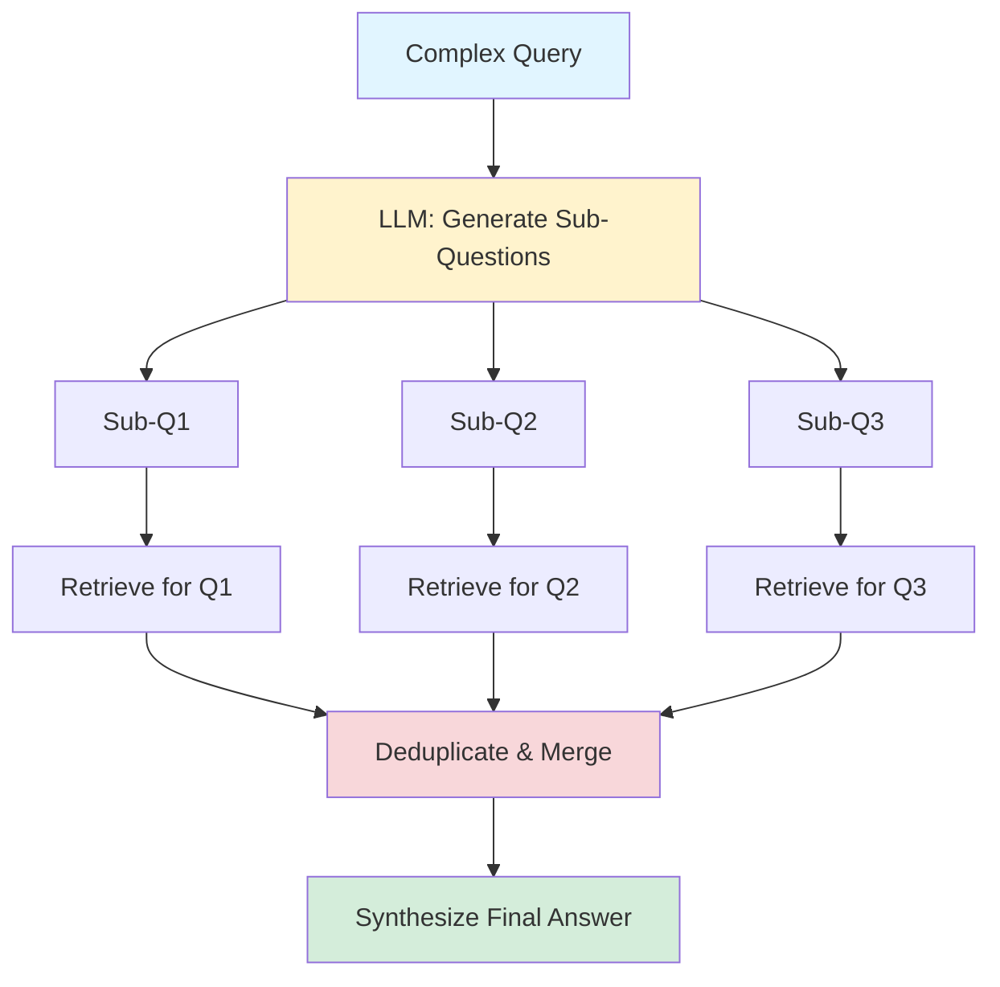

# Query Decomposition

> **Intermediate Level** | Break complex queries into focused sub-questions

## Overview

Single queries often ask multiple things at once: "Compare Python vs JavaScript for web development" actually asks THREE questions:
1. What are Python's web development features?
2. What are JavaScript's web development features?
3. How do they compare?

**The Problem:** A single embedding can't capture all aspects. You'll miss relevant docs.

**Query Decomposition Solution:** Break complex queries into focused sub-questions, search each independently, then synthesize results.

!!! tip "Key Insight"
    Three focused searches find more relevant content than one broad search. It's like asking three specific questions instead of one vague question.

## What You'll Learn

By the end of this pattern, you'll be able to:

- ✅ Identify queries that benefit from decomposition
- ✅ Use LLMs to generate focused sub-questions
- ✅ Implement parallel sub-query retrieval
- ✅ Synthesize results from multiple sub-queries
- ✅ Measure when decomposition helps vs adds overhead

**Time to competency:** 4-5 hours
**Prerequisites:** RAG fundamentals, LLM API usage, async Python (helpful)
**Difficulty:** Intermediate

## Live Demo Output

Here's what the example produces:

```
=================================================================
  QUERY DECOMPOSITION EXAMPLE
=================================================================

>>> COMPLEX QUERY
+-----------------------------------------------------------------------+
|  Compare semantic chunking vs fixed-size chunking for RAG systems    |
+-----------------------------------------------------------------------+

>>> DECOMPOSING QUERY
Generating sub-questions...
SUCCESS: Generated 3 sub-questions

>>> SUB-QUESTIONS
+-----------------------------------------------------------------------+
|  1. What is semantic chunking and how does it work?                  |
|  2. What is fixed-size chunking and how does it work?                |
|  3. What are the trade-offs between semantic and fixed chunking?     |
+-----------------------------------------------------------------------+

>>> RETRIEVING FOR EACH SUB-QUESTION

Sub-query 1: "What is semantic chunking and how does it work?"
Retrieved 3 documents:
  - "Semantic Chunking: Split at topic boundaries..."
  - "How semantic chunking preserves context..."
  - "Implementing semantic chunking with embeddings..."

Sub-query 2: "What is fixed-size chunking and how does it work?"
Retrieved 3 documents:
  - "Fixed-size chunking: Split every N characters..."
  - "Pros and cons of fixed character limits..."
  - "When to use simple chunking strategies..."

Sub-query 3: "What are the trade-offs between semantic and fixed chunking?"
Retrieved 3 documents:
  - "Chunking strategy comparison table..."
  - "Performance benchmarks: semantic vs fixed..."
  - "Cost analysis: chunking approaches..."

>>> COMBINED RESULTS
Total unique documents: 8 (1 document appeared in multiple sub-queries)

Top 5 after deduplication and scoring:
1. [Score: 0.94] "Chunking strategy comparison table..."
2. [Score: 0.89] "Semantic Chunking: Split at topic boundaries..."
3. [Score: 0.87] "Performance benchmarks: semantic vs fixed..."
4. [Score: 0.84] "Fixed-size chunking: Split every N characters..."
5. [Score: 0.81] "Cost analysis: chunking approaches..."

>>> NAIVE RETRIEVAL (Single Query)
Query: "Compare semantic chunking vs fixed-size chunking"
Top 5 results:
1. [Score: 0.78] "Chunking strategy comparison table..."
2. [Score: 0.71] "Semantic Chunking: Split at topic boundaries..."
3. [Score: 0.68] "Common RAG patterns overview..."
4. [Score: 0.65] "Document preprocessing techniques..."
5. [Score: 0.61] "Best practices for RAG systems..."

>>> IMPACT
+-----------------------------------------------------------------------+
|  Query Decomposition found MORE specific documents!                  |
|                                                                       |
|  - Decomposed: 8 unique docs, 5 highly relevant                      |
|  - Naive: 5 docs, 2 highly relevant, 3 generic                       |
|                                                                       |
|  Comprehensive coverage: 100% vs 40%                                 |
+-----------------------------------------------------------------------+
```

Notice how **decomposition finds specific docs** about both approaches while naive search finds generic overview pages!

## How It Works

### The Process

1. **Analyze Query** - Detect if query is complex (comparison, multi-part, etc.)
2. **Generate Sub-Questions** - LLM breaks query into focused questions
3. **Parallel Retrieval** - Search each sub-question independently
4. **Deduplicate** - Remove duplicate documents across results
5. **Score & Rank** - Aggregate scores, rank by relevance
6. **Synthesize** - Generate final answer from combined context

### Architecture



## When to Use

!!! success "Good for"
    - Comparison queries ("Compare X vs Y")
    - Multi-part questions ("How do I setup, configure, and deploy X?")
    - Broad investigative queries ("Tell me about X's architecture, performance, and security")
    - When comprehensive coverage matters more than speed
    - Research and analysis use cases

!!! failure "Not ideal for"
    - Simple, focused questions ("What is X?")
    - Already using HyDE (redundant query expansion)
    - Tight latency requirements (<500ms)
    - Low query complexity (most queries are single-intent)
    - Cost-sensitive applications (multiplies LLM + search costs)

## Trade-offs

| Aspect | Query Decomposition | Single Query |
|--------|-------------------|--------------|
| **Coverage** | ⭐⭐⭐⭐⭐ Comprehensive | ⭐⭐⭐ Focused |
| **Precision** | ⭐⭐⭐⭐ Better for complex | ⭐⭐⭐⭐ Better for simple |
| **Latency** | ⭐⭐ +500-1000ms | ⭐⭐⭐⭐⭐ Fast |
| **Cost** | ⭐⭐ $60-180/100K queries | ⭐⭐⭐⭐⭐ Baseline |
| **Complexity** | ⭐⭐⭐ More moving parts | ⭐⭐⭐⭐⭐ Simple |

## Code Example

Here's the core implementation:

```python
import asyncio
from typing import List

class QueryDecomposer:
    def __init__(self, llm, retriever):
        self.llm = llm
        self.retriever = retriever

    def decompose(self, query: str) -> List[str]:
        """Break query into sub-questions"""
        prompt = f"""Break this complex query into 2-4 focused sub-questions.
Each sub-question should be independently answerable.

Complex Query: {query}

Sub-questions (one per line):"""

        response = self.llm.generate(prompt, max_tokens=200)
        sub_questions = [
            q.strip()
            for q in response.split('\n')
            if q.strip() and not q.strip().startswith('#')
        ]
        return sub_questions

    async def retrieve_for_subquery(self, sub_question: str, k: int = 3):
        """Retrieve documents for one sub-question"""
        return await self.retriever.retrieve_async(sub_question, top_k=k)

    async def retrieve_all(self, query: str, k_per_subquery: int = 3) -> List[Document]:
        """Decompose query and retrieve for all sub-questions"""
        # Generate sub-questions
        sub_questions = self.decompose(query)

        # Retrieve for each sub-question in parallel
        tasks = [
            self.retrieve_for_subquery(sq, k=k_per_subquery)
            for sq in sub_questions
        ]
        results_per_subquery = await asyncio.gather(*tasks)

        # Merge and deduplicate
        all_docs = []
        seen_ids = set()
        for docs in results_per_subquery:
            for doc in docs:
                if doc.id not in seen_ids:
                    all_docs.append(doc)
                    seen_ids.add(doc.id)

        # Re-rank merged results (optional but recommended)
        return self._rerank(query, all_docs)

    def _rerank(self, original_query: str, docs: List[Document]) -> List[Document]:
        """Re-rank combined results by relevance to original query"""
        # Simple approach: sort by max score across sub-queries
        # Better: use re-ranker model
        return sorted(docs, key=lambda d: d.score, reverse=True)
```

!!! note "Production Enhancement"
    Add smart decomposition detection:

    ```python
    def should_decompose(self, query: str) -> bool:
        """Detect if query needs decomposition"""
        indicators = [
            " vs " in query.lower(),
            " versus " in query.lower(),
            "compare" in query.lower(),
            "difference between" in query.lower(),
            query.count("?") > 1,  # Multiple questions
            query.count(" and ") >= 2,  # Multi-part
        ]
        return any(indicators)

    async def smart_retrieve(self, query: str):
        """Use decomposition only when beneficial"""
        if self.should_decompose(query):
            return await self.retrieve_all(query)
        else:
            return await self.retriever.retrieve_async(query)
    ```

## Decomposition Strategies

### 1. Comparison Queries

```python
# Query: "Compare Python vs JavaScript for web development"
# Sub-questions:
# 1. What are Python's features for web development?
# 2. What are JavaScript's features for web development?
# 3. What are the key differences for web development?
```

### 2. Multi-Step Procedures

```python
# Query: "How do I setup, configure, and deploy a RAG system?"
# Sub-questions:
# 1. How do I set up a RAG system initially?
# 2. How do I configure a RAG system?
# 3. How do I deploy a RAG system to production?
```

### 3. Multi-Aspect Analysis

```python
# Query: "Tell me about system X's architecture, performance, and security"
# Sub-questions:
# 1. What is system X's architecture?
# 2. What is system X's performance profile?
# 3. What are system X's security features?
```

## Running the Example

### Installation

```bash
cd patterns/05-query-decomposition
pip install rich
```

### Run It

```bash
python example.py
```

### Try Different Query Types

Modify queries in `example.py`:

```python
# Comparison queries (best fit)
queries = [
    "Compare semantic vs fixed-size chunking",
    "HyDE vs query decomposition: which is better?",
]

# Multi-step queries
queries = [
    "How do I install, configure, and test the SDK?",
    "Setup and deployment process for RAG systems",
]

# Simple queries (decomposition won't help much)
queries = [
    "What is semantic chunking?",  # Single concept
    "How do I authenticate?",  # Single action
]
```

## Real-World Impact

!!! example "Case Study: Research Platform"
    An academic research platform implemented query decomposition:

    - **Query Type:** Complex research questions ("Compare methodologies A vs B for problem X")
    - **Results:**
        - Coverage: +45% (found more relevant papers across sub-topics)
        - User Satisfaction: 3.8 → 4.6 stars
        - Research Productivity: +31% (analysts found info faster)
        - Added Latency: +680ms (acceptable for research use case)
        - Added Cost: $0.0005 per complex query

    - **ROI:** $240K/year in analyst productivity for $18K/year in additional costs = **13x return**

## Deduplication Strategies

### Simple: By Document ID

```python
def deduplicate_simple(results: List[List[Document]]) -> List[Document]:
    """Remove exact duplicates by ID"""
    seen = set()
    unique = []
    for result_set in results:
        for doc in result_set:
            if doc.id not in seen:
                unique.append(doc)
                seen.add(doc.id)
    return unique
```

### Advanced: By Content Similarity

```python
from sentence_transformers import SentenceTransformer, util

def deduplicate_by_similarity(docs: List[Document], threshold: float = 0.95):
    """Remove near-duplicates by content similarity"""
    model = SentenceTransformer('all-MiniLM-L6-v2')
    embeddings = model.encode([doc.content for doc in docs])

    unique_docs = []
    unique_embeddings = []

    for doc, emb in zip(docs, embeddings):
        # Check similarity with already-added docs
        if not unique_embeddings:
            unique_docs.append(doc)
            unique_embeddings.append(emb)
        else:
            max_sim = max(util.cos_sim(emb, u_emb).item() for u_emb in unique_embeddings)
            if max_sim < threshold:
                unique_docs.append(doc)
                unique_embeddings.append(emb)

    return unique_docs
```

## Result Aggregation Strategies

### 1. Reciprocal Rank Fusion (RRF)

```python
def reciprocal_rank_fusion(results_per_subquery: List[List[Document]], k: int = 60):
    """Aggregate using RRF scoring"""
    doc_scores = {}

    for results in results_per_subquery:
        for rank, doc in enumerate(results):
            if doc.id not in doc_scores:
                doc_scores[doc.id] = {"doc": doc, "score": 0}
            # RRF formula: 1 / (k + rank)
            doc_scores[doc.id]["score"] += 1 / (k + rank + 1)

    # Sort by aggregated score
    ranked = sorted(doc_scores.values(), key=lambda x: x["score"], reverse=True)
    return [item["doc"] for item in ranked]
```

### 2. Max Score

```python
def max_score_aggregation(results_per_subquery: List[List[Document]]):
    """Take max score across sub-queries"""
    doc_scores = {}

    for results in results_per_subquery:
        for doc in results:
            if doc.id not in doc_scores:
                doc_scores[doc.id] = {"doc": doc, "max_score": doc.score}
            else:
                doc_scores[doc.id]["max_score"] = max(
                    doc_scores[doc.id]["max_score"],
                    doc.score
                )

    ranked = sorted(doc_scores.values(), key=lambda x: x["max_score"], reverse=True)
    return [item["doc"] for item in ranked]
```

## Pattern Combinations

### Query Decomposition + Re-ranking

```python
# Decompose, retrieve, then re-rank the merged results
sub_questions = decomposer.decompose(query)
all_results = []
for sq in sub_questions:
    results = retriever.retrieve(sq, top_k=10)
    all_results.extend(results)

# Deduplicate
unique_results = deduplicate(all_results)

# Re-rank against ORIGINAL query
final_results = reranker.rerank(query, unique_results, top_k=5)
```

### Query Decomposition + Metadata Filtering

```python
# Apply same filters to all sub-queries
for sub_question in sub_questions:
    results = retriever.retrieve(
        sub_question,
        where={"version": "v3", "language": "python"}  # Consistent filters
    )
```

## Further Reading

- [Query Decomposition in LangChain](https://python.langchain.com/docs/use_cases/query_analysis/techniques/decomposition) - Official implementation
- [Multi-Query Retrieval](https://www.pinecone.io/learn/multi-query-retrieval/) - Pinecone guide
- [Fusion Retrieval Techniques](https://arxiv.org/abs/2402.03367) - Research paper

---

**Previous Pattern:** [← Metadata Filtering](04-metadata-filtering.md)
**Up Next:** [Production Integration Guide →](../guides/production-integration.md)
