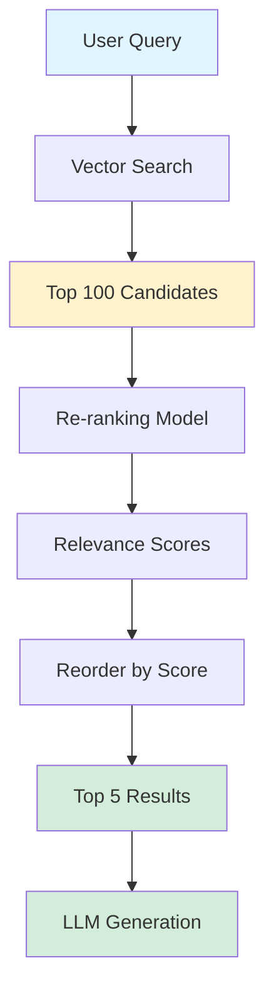

# Re-ranking

> **Beginner Level** | Two-stage retrieval for improved relevance

## Problem Statement

Vector search is fast but imprecise—it retrieves candidates based on embedding similarity, which sometimes surfaces semantically similar but contextually wrong results. Retrieving 100 candidates and hoping the LLM picks the right ones wastes context window space and increases hallucination risk.

## How It Works

Re-ranking uses a two-stage approach:

1. **Stage 1 (Fast):** Vector search retrieves a large pool of candidates (50-100 docs)
2. **Stage 2 (Precise):** A re-ranking model scores each candidate against the query, reorders them by relevance

The re-ranking model is slower but more accurate than vector similarity. By only re-ranking the top candidates (not the entire database), we get the best of both worlds: speed and precision.

**Key Insight:** Cast a wide net with vector search, then use a precise model to pick the best catches.

### The Process

1. **Vector Retrieval** - Fast semantic search retrieves top 50-100 candidates
2. **Re-ranking** - Cross-encoder or LLM scores each candidate
3. **Reorder** - Sort by re-ranking scores
4. **Select Top-K** - Return only the most relevant results (top 5-10)

## Architecture



## When to Use

✅ **Good for:**
- High-stakes retrieval (medical, legal, financial)
- When precision matters more than speed
- Large knowledge bases where vector search recall is noisy
- Systems with sufficient latency budget (+100-500ms acceptable)

❌ **Not ideal for:**
- Real-time systems with strict latency requirements (<100ms)
- Small knowledge bases (< 1000 docs) where vector search is already precise
- High-throughput systems (re-ranking adds compute cost)
- When embedding quality is already excellent

## Trade-offs

| Aspect | With Re-ranking | Vector Search Only |
|--------|----------------|-------------------|
| **Precision** | ⭐⭐⭐⭐⭐ High accuracy | ⭐⭐⭐ Good but noisy |
| **Recall** | ⭐⭐⭐⭐⭐ Same as vector | ⭐⭐⭐⭐⭐ Depends on embeddings |
| **Latency** | ⭐⭐⭐ +200ms typical | ⭐⭐⭐⭐⭐ ~50ms |
| **Cost** | ⭐⭐⭐ +inference cost | ⭐⭐⭐⭐ Vector ops only |
| **Setup Complexity** | ⭐⭐⭐ Requires re-ranker | ⭐⭐⭐⭐⭐ Simple |

## Code Example

Here's a simplified implementation:

```python
from typing import List, Tuple

class ReRankingRetriever:
    def __init__(self, vector_db, reranker):
        self.vector_db = vector_db
        self.reranker = reranker

    def retrieve(self, query: str, top_k: int = 5) -> List[Document]:
        """
        Two-stage retrieval with re-ranking.

        Engineering decision: Retrieve 10x more candidates than needed, then
        use a precise model to pick the best ones. This balances speed
        (vector search) with accuracy (re-ranking).
        """
        # Stage 1: Fast vector search for candidates
        candidate_count = top_k * 10  # Retrieve 10x more candidates
        candidates = self.vector_db.search(query, top_k=candidate_count)

        # Stage 2: Re-rank candidates
        scored_candidates = []
        for doc in candidates:
            score = self.reranker.score(query, doc.content)
            scored_candidates.append((doc, score))

        # Sort by re-ranking score (not vector similarity!)
        scored_candidates.sort(key=lambda x: x[1], reverse=True)

        # Return top K after re-ranking
        return [doc for doc, score in scored_candidates[:top_k]]
```

**Production Enhancement:** Use cross-encoder models for better accuracy:

```python
from sentence_transformers import CrossEncoder

class CrossEncoderReRanker:
    def __init__(self, model_name="cross-encoder/ms-marco-MiniLM-L-6-v2"):
        self.model = CrossEncoder(model_name)

    def score(self, query: str, document: str) -> float:
        """
        Score query-document pair using cross-encoder.

        Cross-encoders jointly encode query+document, providing more
        accurate relevance scores than comparing separate embeddings.
        """
        return self.model.predict([(query, document)])[0]
```

## Running the Example

```bash
# Install dependencies
pip install rich sentence-transformers

# Run the example
cd patterns/03-reranking
python example.py

# Run tests
pytest test_example.py -v
```

**Expected Output:**
- Vector search results (top 10 candidates)
- Re-ranked results (top 5 after scoring)
- Score comparison showing precision improvement

## Real-World Impact

**Case Study:** An e-commerce product search system added re-ranking on top of vector search:

- **Click-Through Rate:** +18% (users clicked on results more often)
- **Add-to-Cart Rate:** +12% (better product matches)
- **Latency:** +180ms (acceptable for product browsing)
- **Infrastructure Cost:** +15% (re-ranker inference)

**Trade-off Analysis:** The conversion improvement far outweighed the latency and cost increases.

## Re-ranking Models

**Cross-Encoders:**
- Most accurate (jointly encode query+doc)
- Slower (can't pre-compute)
- Example: `cross-encoder/ms-marco-MiniLM-L-6-v2`

**LLM-based:**
- Very accurate (reasoning capability)
- Expensive and slow
- Example: "Rate relevance of this doc 1-10: {doc}"

**Lightweight Scorers:**
- Fast (simple neural networks)
- Less accurate than cross-encoders
- Good for high-throughput systems

## Further Reading

- 📄 [ColBERT: Efficient and Effective Passage Search](https://arxiv.org/abs/2004.12832) - Late interaction for re-ranking
- 📄 [RankGPT: LLM-based Re-ranking](https://arxiv.org/abs/2304.09542) - Using LLMs for relevance
- 🎓 [Cross-Encoders for Re-ranking](https://www.sbert.net/examples/applications/cross-encoder/README.html) - Practical guide
- 📊 [BEIR Benchmark](https://github.com/beir-cellar/beir) - Evaluate retrieval + re-ranking

---

**Previous Pattern:** [← 02-hyde](../02-hyde/README.md)
**Next Pattern:** [04-metadata-filtering →](../04-metadata-filtering/README.md) | Pre-filter with structured data
