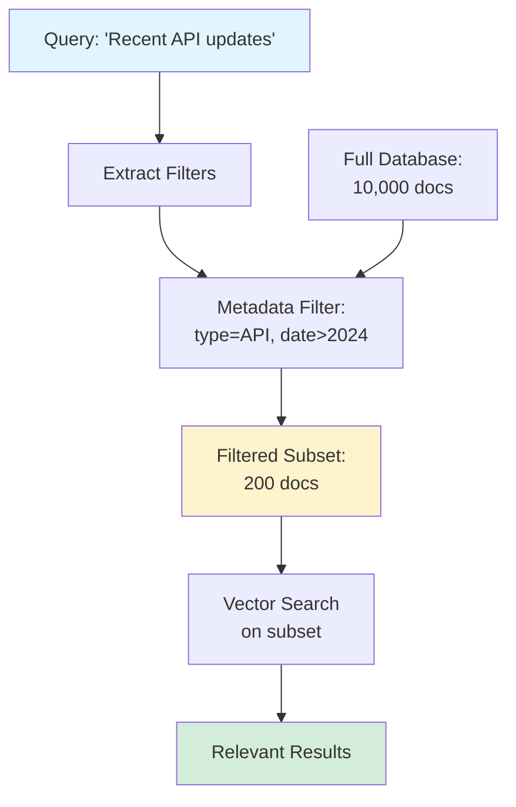

# Metadata Filtering

> **Beginner Level** | Pre-filter with structured data before vector search

## Problem Statement

Vector search alone treats all documents equally—it can't distinguish between a 2019 blog post and a 2024 official doc, or between public and internal content. You end up retrieving semantically similar but contextually wrong results (outdated info, wrong department, incorrect language, etc.).

## How It Works

Metadata filtering adds structured attributes to documents (date, author, category, access level, etc.) and filters them **before** running vector search. This dramatically reduces the search space and ensures results meet hard constraints.

**Key Insight:** Use metadata for "must-have" filters, use vectors for "nice-to-have" semantic matching.

### The Process

1. **Index Time** - Store documents with metadata (date, category, tags, etc.)
2. **Query Time** - Extract filters from query or context
3. **Pre-filter** - Apply metadata constraints first
4. **Vector Search** - Search only within filtered subset
5. **Return Results** - All results satisfy both metadata AND semantic criteria

## Architecture



## When to Use

✅ **Good for:**
- Time-sensitive content (news, documentation versions, product releases)
- Multi-tenant systems (filter by user/organization)
- Compliance requirements (access control, data residency)
- Multi-language content (filter by language code)
- Content with clear categories (department, topic, source)

❌ **Not ideal for:**
- Homogeneous knowledge bases (all docs similar metadata)
- When users can't express filters clearly
- Small datasets where filtering provides minimal benefit
- When metadata is unreliable or incomplete

## Trade-offs

| Aspect | With Metadata Filtering | Vector Only |
|--------|------------------------|-------------|
| **Precision** | ⭐⭐⭐⭐⭐ Guaranteed constraints | ⭐⭐⭐ May return wrong context |
| **Recall** | ⭐⭐⭐⭐ Narrows search space | ⭐⭐⭐⭐⭐ Searches everything |
| **Speed** | ⭐⭐⭐⭐⭐ Smaller search space | ⭐⭐⭐⭐ Full database scan |
| **Setup** | ⭐⭐⭐ Requires metadata schema | ⭐⭐⭐⭐⭐ Just embeddings |
| **Maintenance** | ⭐⭐⭐ Keep metadata updated | ⭐⭐⭐⭐⭐ Minimal |

## Code Example

Here's a simplified implementation:

```python
from typing import List, Dict, Any
from datetime import datetime

class MetadataFilteredRetriever:
    def __init__(self, vector_db):
        self.vector_db = vector_db

    def retrieve(self, query: str, filters: Dict[str, Any],
                top_k: int = 5) -> List[Document]:
        """
        Retrieve with metadata filtering.

        Engineering decision: Apply metadata filters BEFORE vector search
        to reduce search space and enforce hard constraints.
        """
        # Apply metadata filters first
        filtered_docs = self.vector_db.filter_by_metadata(filters)

        # Then vector search on filtered subset
        results = self.vector_db.search(
            query=query,
            documents=filtered_docs,
            top_k=top_k
        )

        return results
```

**Common Filter Patterns:**

```python
# Time-based filtering
filters = {
    "date": {"$gte": "2024-01-01"},  # Greater than or equal
    "date": {"$lte": "2024-12-31"}   # Less than or equal
}

# Category filtering
filters = {
    "category": {"$in": ["API", "SDK", "CLI"]},  # Any of these
    "status": "published"
}

# Multi-condition filtering
filters = {
    "$and": [
        {"department": "engineering"},
        {"access_level": {"$in": ["public", "internal"]}},
        {"language": "en"}
    ]
}

# Exclusion filtering
filters = {
    "source": {"$ne": "deprecated_docs"},  # Not equal
    "type": {"$nin": ["draft", "archived"]}  # Not in list
}
```

## Running the Example

```bash
# Install dependencies
pip install rich

# Run the example
cd patterns/04-metadata-filtering
python example.py

# Run tests
pytest test_example.py -v
```

**Expected Output:**
- Unfiltered results (searches entire database)
- Filtered results (only matches metadata criteria)
- Comparison showing precision improvement

## Real-World Impact

**Case Study:** A documentation search system added metadata filtering:

- **Wrong Version Errors:** -78% (users stopped finding outdated docs)
- **Language Mix-ups:** -100% (perfect language filtering)
- **Search Speed:** +35% faster (smaller search space)
- **User Satisfaction:** 3.9 → 4.6 stars

**Filter Breakdown:**
- `version` (API v1 vs v2 vs v3)
- `language` (en, es, fr, de, ja)
- `doc_type` (tutorial, reference, guide)
- `last_updated` (ensure freshness)

## Vector Database Support

Most vector databases support metadata filtering:

**Pinecone:**
```python
index.query(
    vector=embedding,
    filter={"category": {"$eq": "API"}, "date": {"$gte": "2024-01-01"}},
    top_k=5
)
```

**Weaviate:**
```python
client.query.get("Document", ["content"]).with_where({
    "path": ["category"],
    "operator": "Equal",
    "valueString": "API"
}).with_near_vector({"vector": embedding}).do()
```

**ChromaDB:**
```python
collection.query(
    query_embeddings=[embedding],
    where={"category": "API", "date": {"$gte": "2024-01-01"}},
    n_results=5
)
```

## Further Reading

- 📄 [Pinecone Metadata Filtering](https://docs.pinecone.io/docs/metadata-filtering) - Comprehensive guide
- 📄 [Weaviate Filtering](https://weaviate.io/developers/weaviate/search/filters) - Filter operators
- 🎓 [Building Multi-Tenant RAG](https://www.pinecone.io/learn/multi-tenancy/) - Isolation with filters
- 📊 [ChromaDB Where Filters](https://docs.trychroma.com/usage-guide#using-where-filters) - Query syntax

---

**Previous Pattern:** [← 03-reranking](../03-reranking/README.md)
**Next Pattern:** More patterns coming soon!
