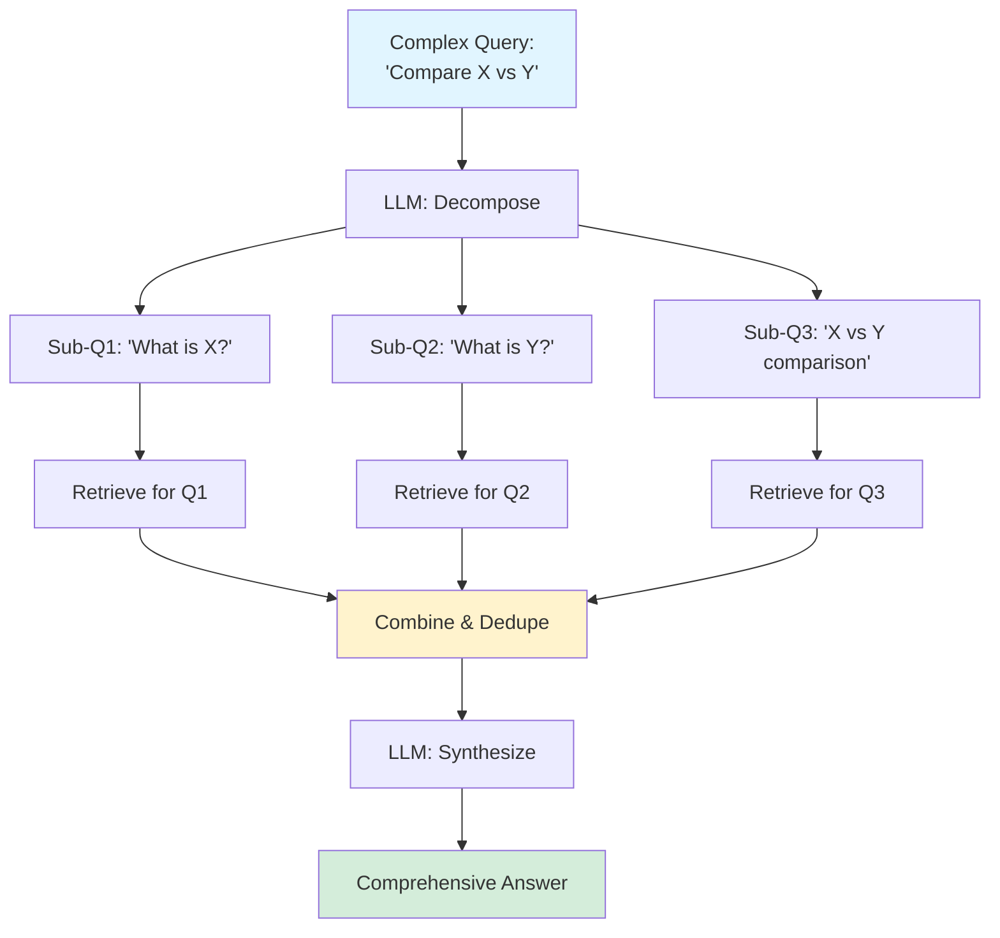

# Query Decomposition

> **Intermediate Level** | Break complex queries into focused sub-questions

## Problem Statement

Users often ask complex, multi-part questions like "Compare approach X vs Y in terms of performance and cost." A single vector search returns documents vaguely related to everything, but nothing that directly addresses each specific aspect. The LLM then struggles to synthesize a coherent answer from loosely related context.

## How It Works

Query decomposition breaks complex questions into simpler sub-questions, retrieves documents for each independently, then combines the results. Each sub-query gets focused, relevant context rather than diluted results from the original broad query.

**Key Insight:** Multiple precise searches beat one vague search.

### The Process

1. **Analyze Query** - Identify if query has multiple parts/aspects
2. **Decompose** - Break into 2-5 focused sub-questions
3. **Retrieve Each** - Run separate vector searches for each sub-question
4. **Combine Results** - Merge retrieved documents (deduplicate)
5. **Generate Answer** - LLM synthesizes from comprehensive context

## Architecture



## When to Use

✅ **Good for:**
- Comparison questions ("X vs Y")
- Multi-aspect queries ("benefits AND drawbacks")
- Sequential questions ("What is X? How does it work? When to use it?")
- Analytical queries requiring diverse information sources

❌ **Not ideal for:**
- Simple factual questions with single answers
- When query is already focused and specific
- Time-critical systems (decomposition adds latency)
- When sub-questions would be too granular

## Trade-offs

| Aspect | Query Decomposition | Single Query |
|--------|-------------------|--------------|
| **Context Quality** | ⭐⭐⭐⭐⭐ Comprehensive | ⭐⭐⭐ May miss aspects |
| **Retrieval Precision** | ⭐⭐⭐⭐⭐ Focused sub-queries | ⭐⭐⭐ Broad/vague results |
| **Latency** | ⭐⭐⭐ +500ms (decompose + 3x retrieval) | ⭐⭐⭐⭐⭐ Single search |
| **Cost** | ⭐⭐⭐ More API calls | ⭐⭐⭐⭐ Minimal |
| **Answer Completeness** | ⭐⭐⭐⭐⭐ Addresses all aspects | ⭐⭐⭐ May be incomplete |

## Code Example

Here's a simplified implementation:

```python
from typing import List

class QueryDecomposer:
    def __init__(self, llm, retriever):
        self.llm = llm
        self.retriever = retriever

    def retrieve(self, complex_query: str, top_k_per_query: int = 3) -> List[Document]:
        """
        Retrieve with query decomposition.

        Engineering decision: Break complex queries into focused sub-questions
        that each retrieve highly relevant documents, rather than one vague
        search that returns loosely related results.
        """
        # Step 1: Decompose query into sub-questions
        sub_questions = self._decompose_query(complex_query)

        # Step 2: Retrieve for each sub-question
        all_results = []
        for sub_q in sub_questions:
            results = self.retriever.search(sub_q, top_k=top_k_per_query)
            all_results.extend(results)

        # Step 3: Deduplicate (same doc might be relevant to multiple sub-questions)
        unique_results = self._deduplicate(all_results)

        return unique_results

    def _decompose_query(self, query: str) -> List[str]:
        """
        Break query into sub-questions.

        Engineering decision: Use LLM to identify distinct aspects that need
        separate retrieval. Typically 2-4 sub-questions is optimal.
        """
        prompt = f"""Break this complex question into 2-4 simpler sub-questions.
Each sub-question should focus on one specific aspect.

Question: {query}

Sub-questions:
1."""

        response = self.llm.generate(prompt)
        # Parse numbered list
        sub_questions = self._parse_list(response)
        return sub_questions
```

**Production Enhancement:** Retrieve in parallel for speed:

```python
import asyncio

async def retrieve_parallel(self, complex_query: str):
    """Retrieve all sub-questions in parallel"""
    sub_questions = self._decompose_query(complex_query)

    # Run retrievals concurrently
    tasks = [
        self.retriever.search_async(sub_q, top_k=3)
        for sub_q in sub_questions
    ]

    results = await asyncio.gather(*tasks)
    all_docs = [doc for result_set in results for doc in result_set]

    return self._deduplicate(all_docs)
```

## Running the Example

```bash
# Install dependencies
pip install rich

# Run the example
cd patterns/05-query-decomposition
python example.py

# Run tests
pytest test_example.py -v
```

**Expected Output:**
- Original complex query
- Decomposed sub-questions (2-4)
- Retrieval results for each sub-question
- Combined, deduplicated results

## Real-World Impact

**Case Study:** A customer support knowledge base added query decomposition:

- **Answer Completeness:** +45% (users rated answers as more thorough)
- **Follow-up Questions:** -38% (users got what they needed first time)
- **Latency:** +620ms (3 parallel retrievals + decomposition)
- **Context Window Usage:** +40% (more diverse docs)

**Trade-off Analysis:** Users valued comprehensive answers over speed for support queries.

## Decomposition Strategies

**Aspect-Based:**
```
"What are the benefits and drawbacks of X?"
→ "What are the benefits of X?"
→ "What are the drawbacks of X?"
```

**Comparison:**
```
"Compare X vs Y"
→ "What is X and its features?"
→ "What is Y and its features?"
→ "Key differences between X and Y"
```

**Sequential:**
```
"How do I set up and use feature X?"
→ "How do I install/set up feature X?"
→ "How do I use feature X?"
→ "What are common issues with feature X?"
```

**Causal:**
```
"Why did event X happen and what are the implications?"
→ "What led to event X?"
→ "What are the direct consequences of event X?"
→ "What are the long-term implications?"
```

## Further Reading

- 📄 [Least-to-Most Prompting](https://arxiv.org/abs/2205.10625) - Sequential decomposition
- 📄 [Self-Ask: Eliciting Reasoning via Prompting](https://arxiv.org/abs/2210.03350) - Iterative decomposition
- 🎓 [Multi-Query Retrieval](https://python.langchain.com/docs/modules/data_connection/retrievers/MultiQueryRetriever) - LangChain implementation
- 📊 [Decomposed Prompting](https://arxiv.org/abs/2210.02406) - Research on breaking down tasks

---

**Previous Pattern:** [← 04-metadata-filtering](../04-metadata-filtering/README.md)
**Next Pattern:** [06-parent-child →](../06-parent-child/README.md) | Hierarchical context retrieval
